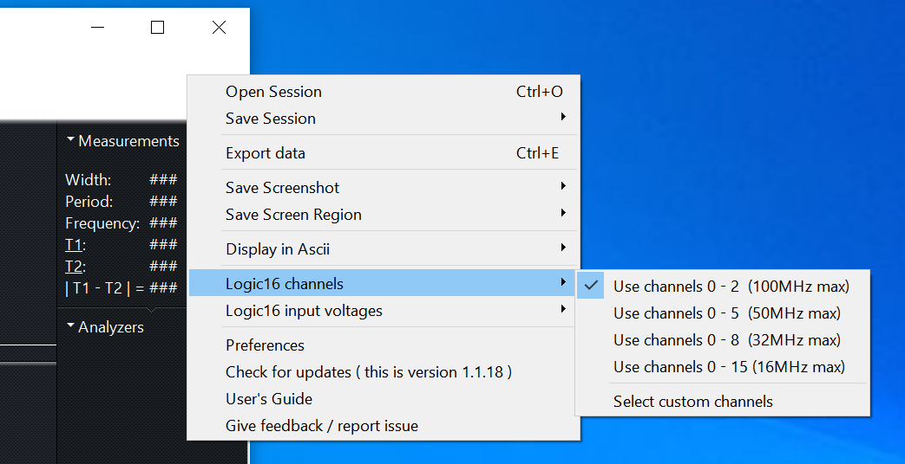
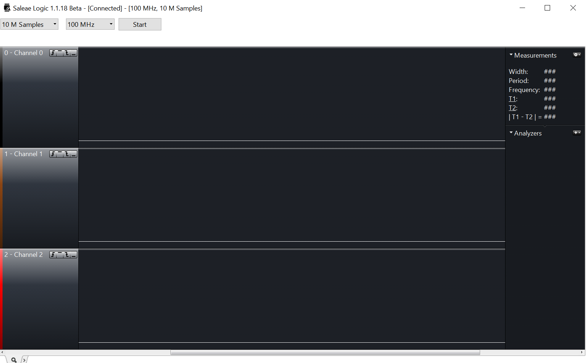

# Saleae16
1. Version 1.1.15 ([official download link](https://support.saleae.com/product/logic-software/legacy-software/older-software-releases#id-1.1.15-download)) and 1.1.18 are no much difference
2. 100Mhz when use < 3 channels, 16Mhz when use 16 channels

>Note, 1.1.15 was 32-bit only release. 

