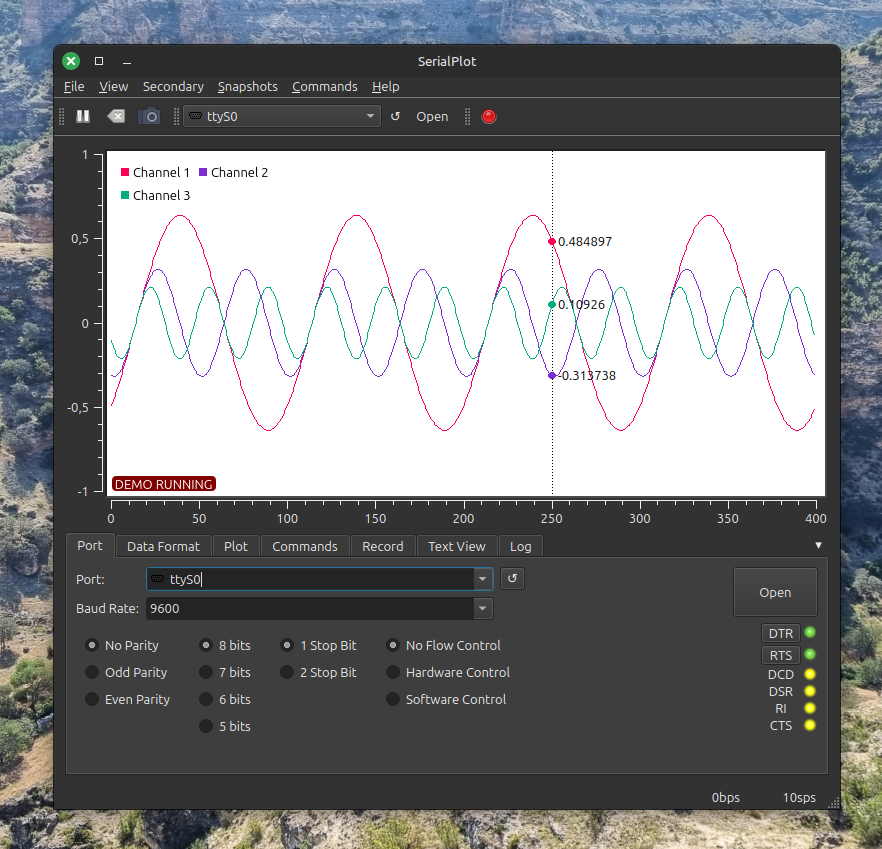

# SerialPlot
* Small and simple software for plotting data from serial port in realtime.
* Official repo: https://github.com/hyOzd/serialplot
* Free, written by Qt

## How to use?

unzip and install the .exe.

## Features

* Reading data from serial port
* Binary data formats (u)int8, (u)int16, (u)int32, float
* User defined frame format for robust operation
* ASCII input (Comma Separated Values)
* Synchronized multi channel plotting
* Define and send commands to the device in ASCII or binary format
* Take snapshots of the current waveform and save to CSV file

