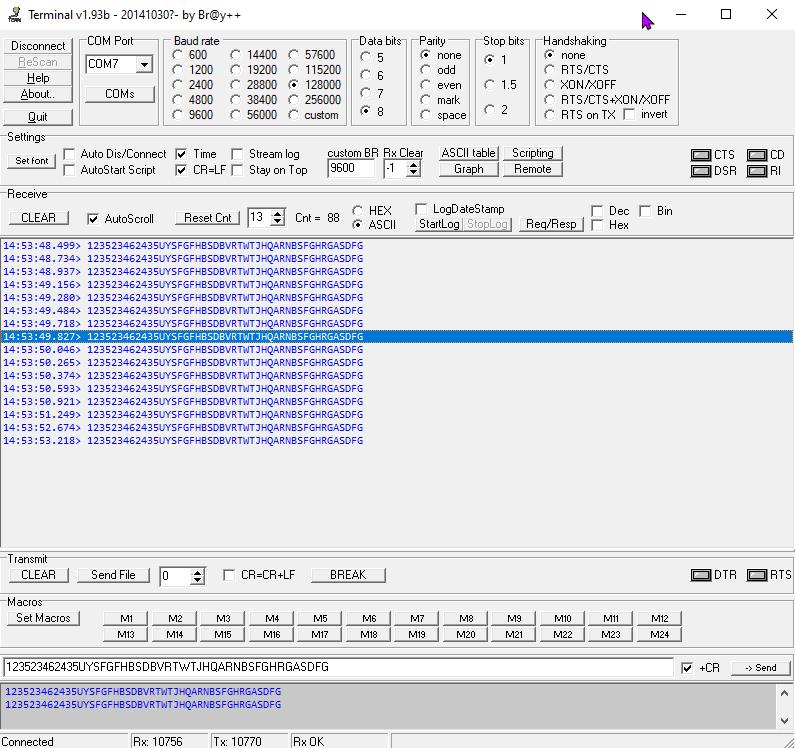
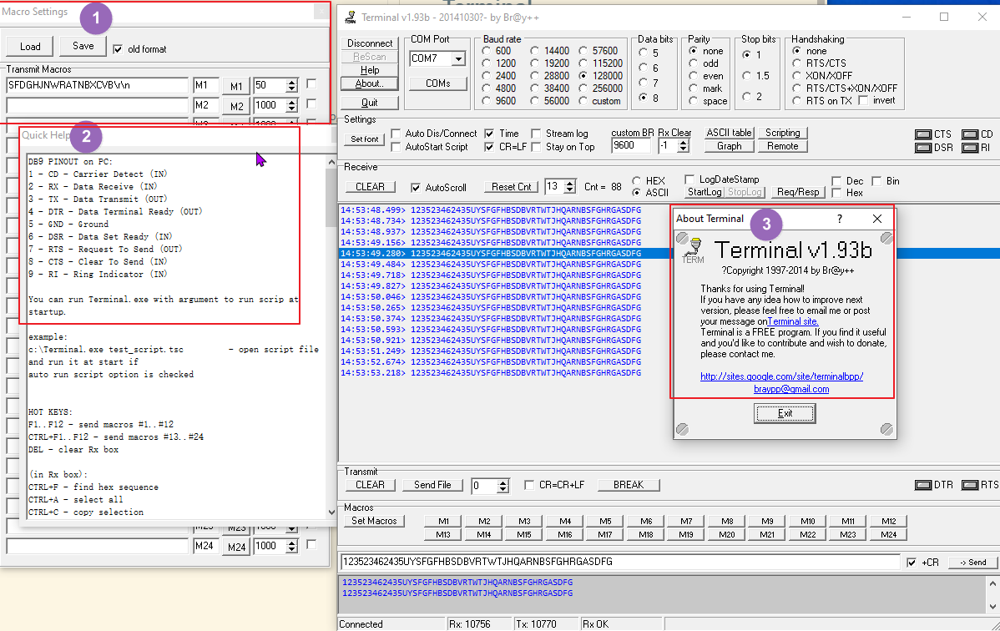

# Terminal

Key takeaway:
* Free, small .exe file
* was from 2014

## How to Use it?
Unzip the file(downloaded from https://sites.google.com/site/terminalbpp/) and run the .exe, that's it. 

## Features
* log to file
* 12 macros
* script
* simple graphic
  

