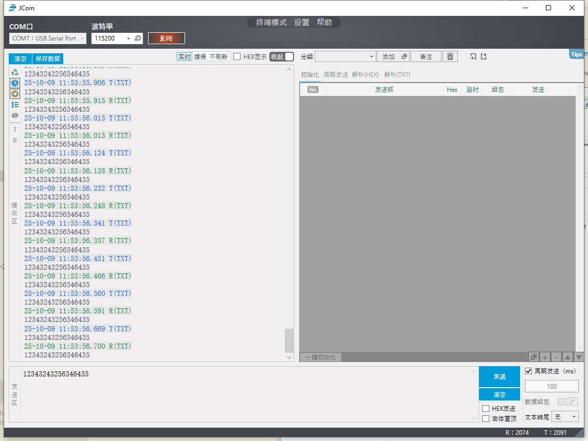
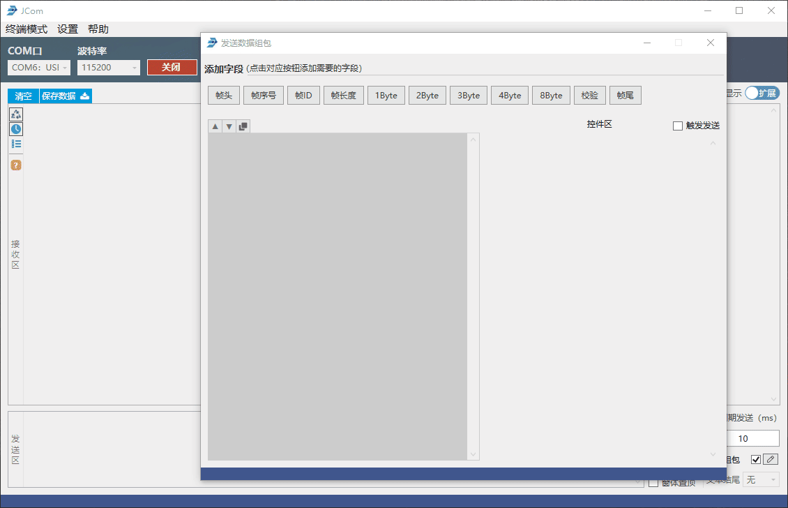
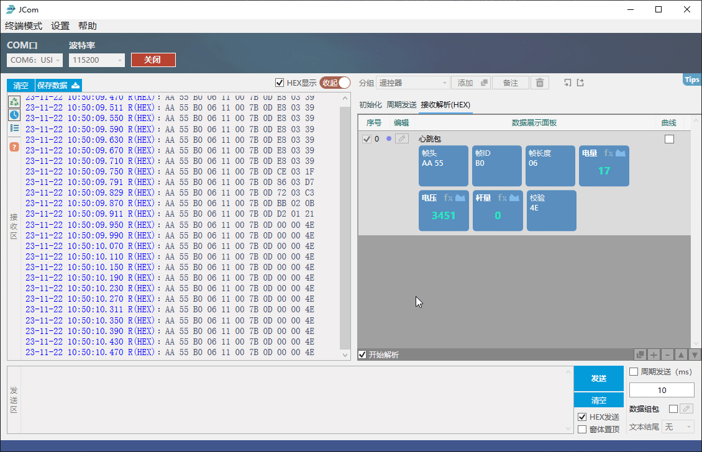
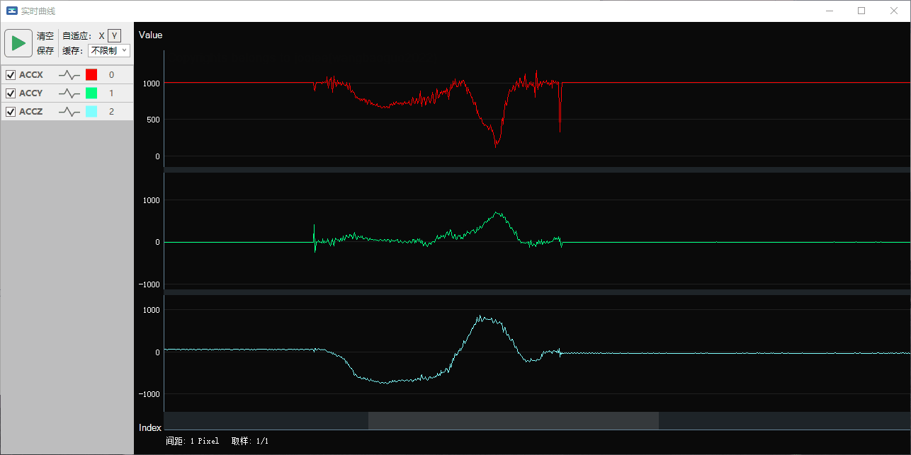
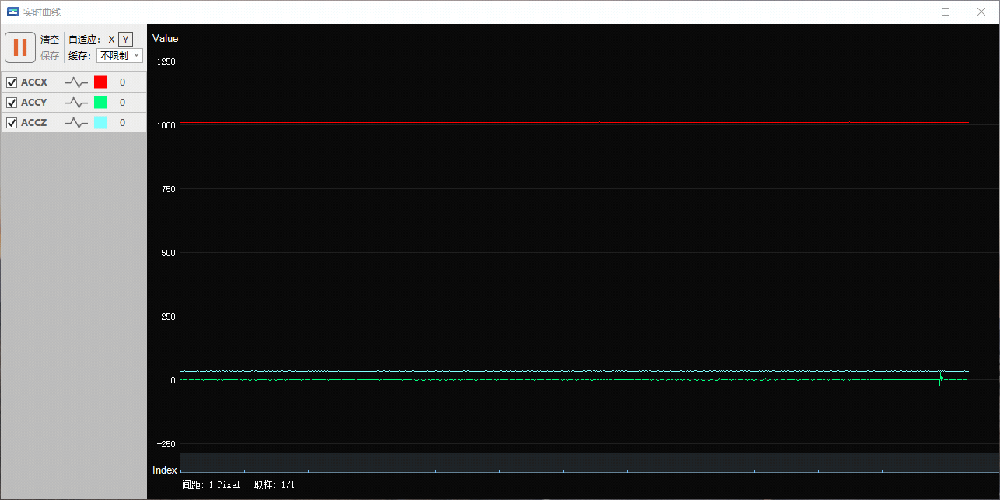

# JCom

# 1. From

It's from : https://jooiee.com/cms/ruanjian/115.html

It's Free, close-source C#, Chinese language only.

**It's green, just click JCom.exe** to run it.
# 2. Usage

# 3. Features (from its website)

