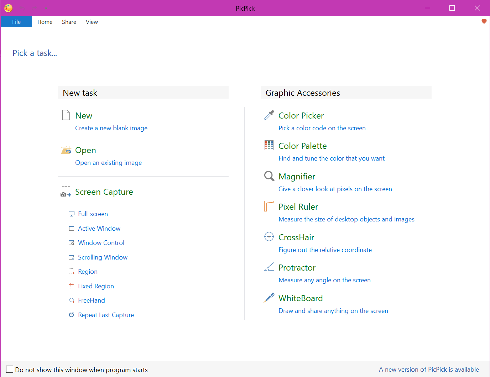

# Picture/Recording/Video Tools

## What Functions Does Picpick have? 

## In Windows 

Both **Windows 11** and **Windows 10** have built-in recording tools:

| Feature                | Windows 11       | Windows 10       |
|------------------------|------------------|------------------|
| Xbox Game Bar          | ✅                | ✅                |
| Snipping Tool (record) | ✅                | ❌                |
| Clipchamp (screen rec) | ✅ (in some builds) | ❌ (not built-in) |

### ✅ **Windows 11:**
- **Clipchamp** (Newer versions)
  - A video editor with screen recording capabilities.
  - Found in the Start Menu or Microsoft Store.

- **Snipping Tool** (Upgraded in Win11)
  - Now includes **screen recording** in addition to screenshots.
  - To use:  
    1. Open **Snipping Tool**  
    2. Click the **camera icon** (for recording)  
    3. Select screen area and hit **Record**  
    4. Save after you're done.

- **Xbox Game Bar**  
  - Shortcut: `Win + G`  
  - Designed mainly for recording games, but works with most apps (not File Explorer or desktop).
  - Hit the **record button** or `Win + Alt + R` to start/stop.

---

### ✅ **Windows 10:**
- **Xbox Game Bar**
  - Also available and works the same way: `Win + G` → Record.
  - It's the main built-in recording tool in Win10.
  - Does **not** record the desktop or File Explorer windows.

- **Snipping Tool** in Windows 10 does **not** support recording — it's only for screenshots. The screen recording feature was added in Windows 11.

