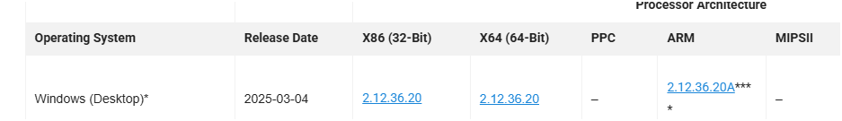
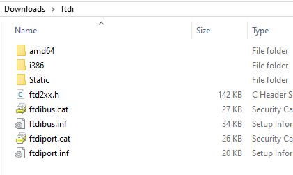
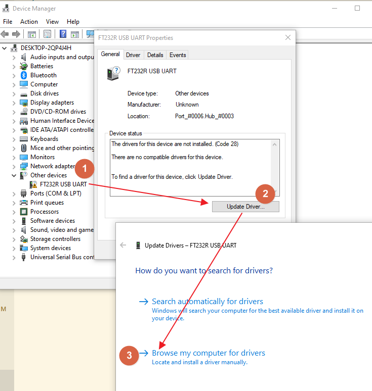
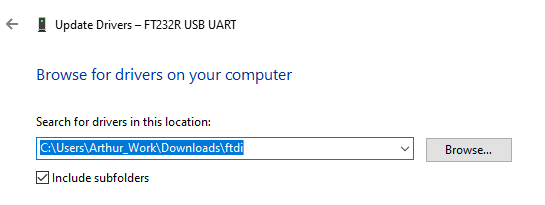
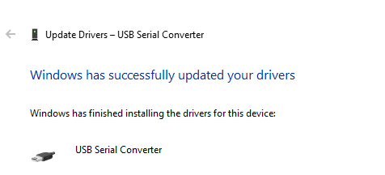

# How to Install driver?

# 1 Unzip the driver files
The file was from: https://ftdichip.com/drivers/vcp-drivers/ 

# 2 Plug the device and go to DeviceManager
1. Double click the device at '1'
2. Click 'Update Driver'
3. Click 'Browse ...' and go to the unzipped files.

# 3 Job Done!

