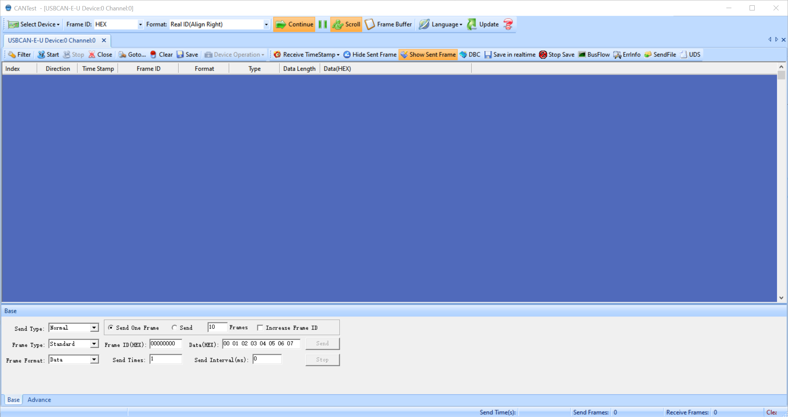
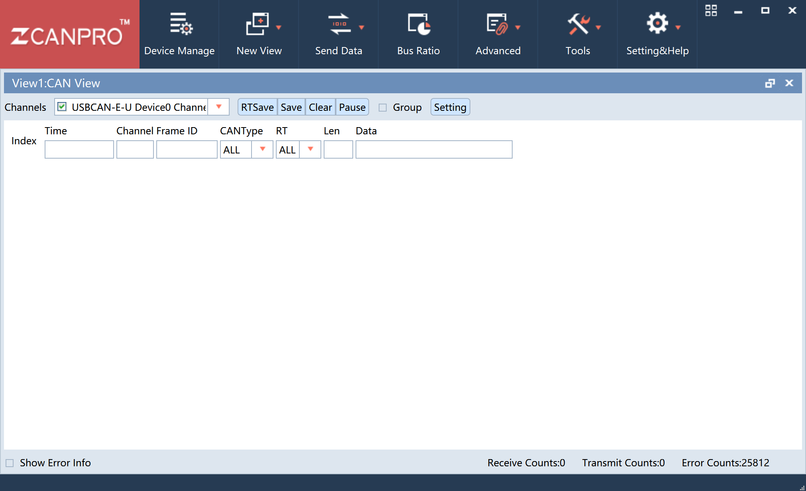

# USBCAN Card
- Product page: https://www.zlg.cn/can/can/product/id/22.html
- Document page: https://www.zlg.cn/can/down/down/id/22.html 
    - USBCAN-E-U Manual: [manual.pdf](USBCAN-E-2E-U_um.pdf)
- You can use either old 'CANTest' or newer 'CANPRO' software, before using, you need to install the driver  , just unzip and install the .exe. 
- the **'SYS'** LED turns **green** if dirver is correct and the device is connected, turns **red** if driver is not right.

## TOOL1

## TOOL2
