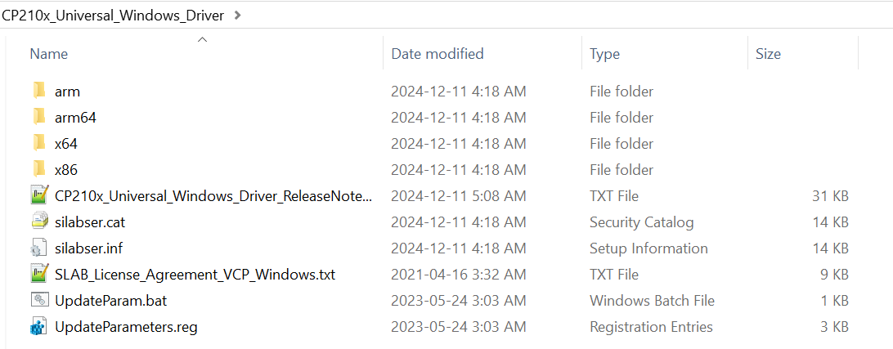
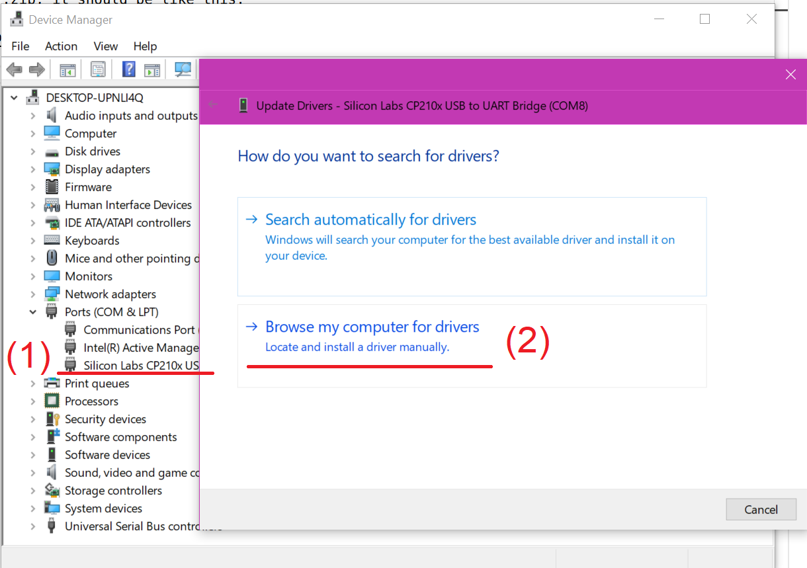

## official website

https://www.silabs.com/developer-tools/usb-to-uart-bridge-vcp-drivers?tab=downloads

## How to install it?

### For windows
step1: extract the .zip, it should be like this:

step2: right-click the device, select 'install a driver manually', browser to the extracted folder and that's done.
